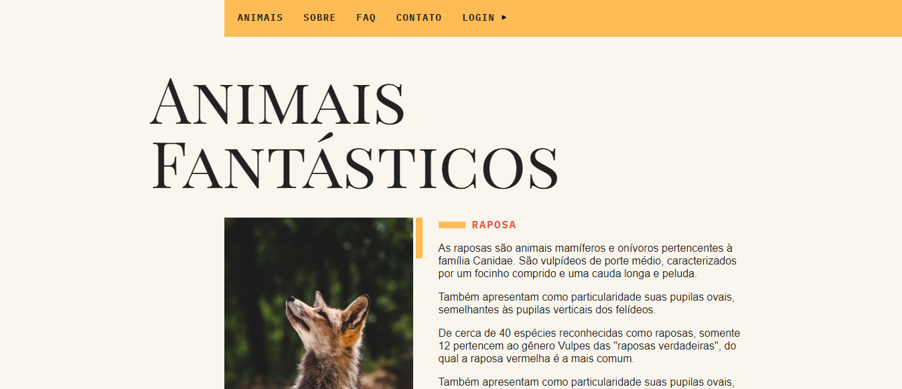
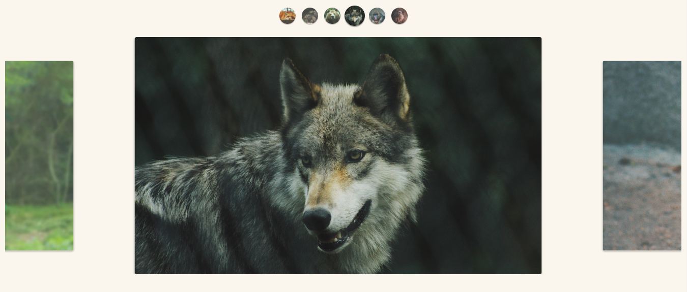
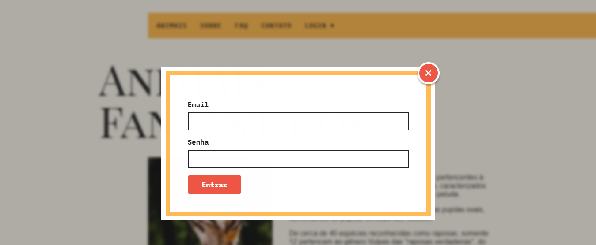
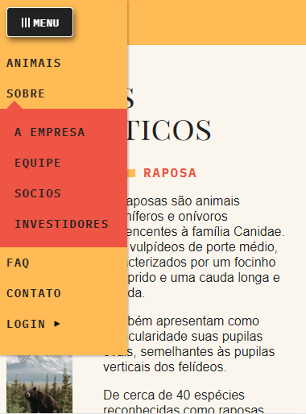
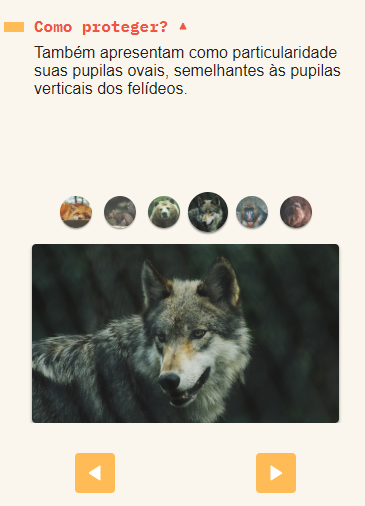

# Animais Fantásticos
Animais fantasticos é um projeto desenvolvido em um curso completo de JavaScript ES6+ na plataforma de curso online Origamid.

O projeto teve como objetivo o aprendizado de vários conceitos relacionados à linguagem de programação JavaScript, começando do básico até enfim chegar em conceitos avançados.

## Manipulação de DOM
Um dos principais diferênciais do curso, é que nele aprendemos diversas animações que são construídas do 0 utilizando apenas a linguagem sí, dispensando o uso de qualquer biblioteca de efeitos. Entre essas animações temos: navegação por tab, animação de scroll suave, tooltip que acompanha o curso do mouse, dentre outros. Para ver mais de perto tudo o que o projeto pode fazer acesse: https://felipevgomes10.github.io/animais-fantasticos/.

## Galeria de imagens
O projeto conta com diversas funcionalidades e partes sendo uma delas uma galeria de imagens que funciona com os eventos de click, mousedown, mouseup, mousemove, touchstart, touchend e resize. A galeria foi criada separadamente do projeto principal e depois importada para ele devido o grau de complexidade da mesma. Ela foi criada como um classe, sendo assim qualquer site pode utilizá-la.

## Modal(Pop-up)
O projeto ainda conto com o clássico, porém útil modal, ou como algumas pessoas preferem chamar "pop-up".

## Mobile Friendly
O site possui total responsividade para dispositivos que possuem diferentes tamanhos de tela.

### Menu mobile responsivo

### Galeria responsiva

Acesse o projeto no github pages: https://felipevgomes10.github.io/animais-fantasticos/
